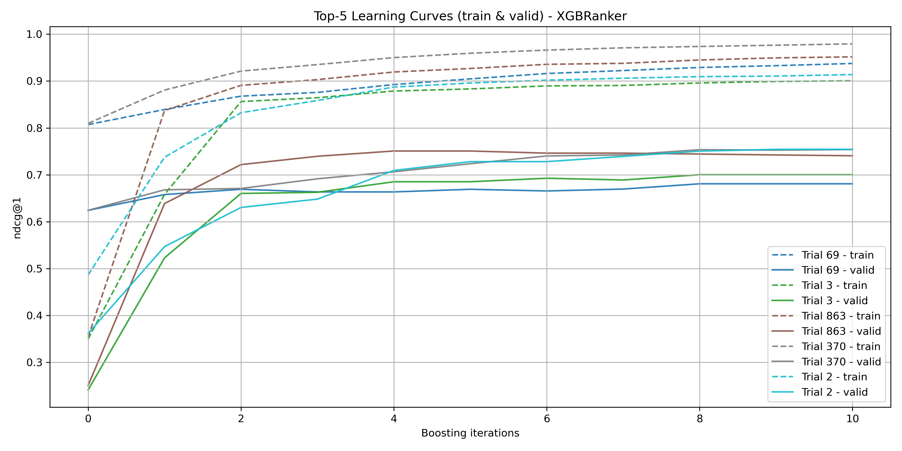

# ml-crossdock-pose-ranker

**Machine Learning model (XGBRanker) for cross-docking pose ranking.**  
This project ranks docking poses so that the top-1 pose is native-like, improving accuracy in molecular docking tasks.

> **⚠️ Note:** This project is still under active development and intended to be published in a scientific article.
>
> - The figures shown below are **preliminary** and may change.
> - The dataset features are still being refined and extended.
> - Code, documentation, and results will be updated regularly as the project evolves.

## Features

- Utilizes XGBRanker from XGBoost for ranking molecular docking poses.
- Focused on cross-docking scenarios.
- Includes training, evaluation, and visualization scripts.
- Configurable parameters via `parameters.py`.
- Easy integration with your dataset.

## Repository Structure

`````
├── app/ # Application code 
├── images/
│   ├── all_valid_learning_curves.png
│   └── topk_learning_curves.png
├── data_crossdock_rmsd_ccf.csv # Dataset in CSV format
├── main.py # Main script for training or inference
├── parameters.py # Configuration and parameters for the model
├── README.md # This documentation file
`````

## Installation

1. Clone the repository:
   ```bash
   git clone git@github.com:jborzunova/ml-crossdock-pose-ranker.git
   cd ml-crossdock-pose-ranker

    (Optional) Create and activate a virtual environment. Install dependencies listed in requirements.txt

Usage:

Run training or inference with:

	python3 main.py

Customize parameters in parameters.py.

## Results

### Validation Learning Curves from Optuna Trials


This figure shows all validation learning curves obtained during hyperparameter optimization with **Optuna**.  
The validation was performed using the **Leave-One-Ligand-Out (LOLO)** strategy to ensure robust generalization across ligands.  
The **best-performing trial** (as selected by Optuna) is highlighted in **red**.

### Top-K Learning Curves (Train & Validation)


This plot illustrates training and validation curves for the **top-K models** (ranked by validation performance).  
It provides insight into model convergence and stability across the most successful configurations.

## Dataset

The dataset used in this project currently consists of **CCF fingerprints** representing molecular features relevant for cross-docking pose ranking.  

These fingerprints capture key chemical characteristics and serve as input features for the XGBRanker model.  

**Note:** Feature engineering is ongoing, and additional descriptors may be added in future updates.

License: [No license yet]

Contact:

Julia Borzunova — [j.n.borzunova@yandex.ru]
GitHub: https://github.com/jborzunova
